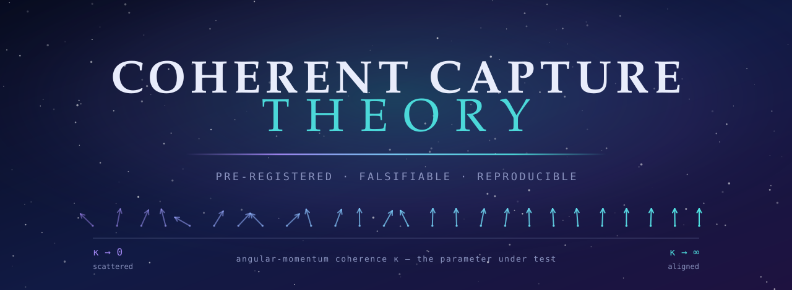
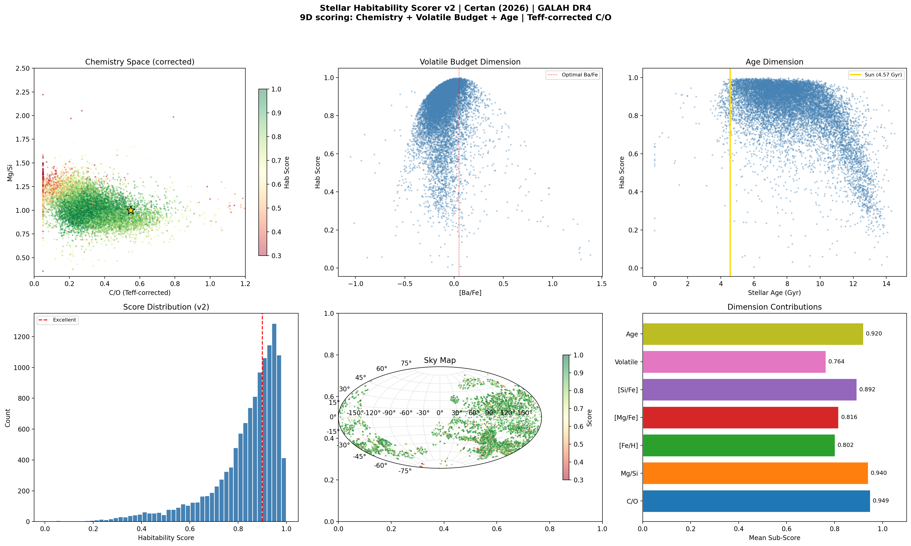

<div align="center">



<br>

[](https://doi.org/10.5281/zenodo.19043096)
[](#license)
[](https://www.galah-survey.org/dr4/)
[](https://www.sdss.org/dr17/)
[](#thread-ii--dynamical-capture)

**Stars carry a permanent chemical record of their birth.**
*This repository contains the analysis that demonstrated it — and the pre-registered tests that falsified everything else.*

**David Certan (2026)**

</div>

---

## Contents

| | |
|---|---|
| [The Question](#the-question) | What CCT actually claims |
| [How This Repository Works](#how-this-repository-works) | The discipline rules that bind every test |
| [Thread I · Chemical Coherence](#thread-i--chemical-coherence) | 12 tests · **survived** |
| [Thread II · Dynamical Capture](#thread-ii--dynamical-capture) | 4 phases · **refuted** |
| [Habitability Catalog](#habitability-catalog-v2) | 9D scorer → 12,234 stars |
| [Observable Targets](#observable-targets) | 917,588 → **18 stars** |
| [TESS Vetting Pipeline](#tess-vetting-pipeline) | Reusable detection stack |
| [Falsification Log](#falsification-log) | What was withdrawn, and why |
| [Reproducing This Work](#reproducing-this-work) | Data, scripts, environment |

---

## The Question

Molecular clouds collapse into clusters. Clusters dissolve into the field. **Does the chemistry of a star's birthplace survive that dissolution — and can it be read back out?**

Two independent lines follow from that question, and this repository tests both:

<table>
<tr>
<td width="50%" valign="top">

### 🧪 Thread I — Chemical
Do co-natal stars share a measurable chemical fingerprint, and how long does it last?

**Status: survived 12 pre-registered tests.**
Fingerprints are permanent (τ > 10 Gyr), multi-dimensional, and recoverable in dissolved field stars — but individual-star recovery is blocked by a hard precision wall.

</td>
<td width="50%" valign="top">

### 🪐 Thread II — Dynamical
Can multi-planet systems be *gravitationally captured* between stars, with angular-momentum coherence (κ) as the controlling parameter?

**Status: refuted by its own test.**
18,000 sealed N-body simulations show κ has no measurable effect on exchange cross-section. The distinctive claim did not survive.

</td>
</tr>
</table>

---

## How This Repository Works

The method is the contribution. Every empirical claim here is bound by six rules, applied without exception:

| | Rule |
|---|---|
| **1** | **Pre-registration before data.** Every test gets a sealed git commit defining hypothesis, sample, statistic, and decision rule *before* the data is touched. |
| **2** | **No goalpost-shifting.** A test that fails its decision rule withdraws the prediction, or a *new* pre-registration is sealed. Failures are never re-read as support. |
| **3** | **Predictions are derived or cited, never asserted.** Every number traces to a sealed derivation or a literature citation. |
| **4** | **Failed replications are withdrawn cleanly.** No quiet burials. |
| **5** | **Null results carry full weight.** A 0/N result is reported as prominently as a positive one. |
| **6** | **No theological framing in the empirical layer.** Mechanism, prediction, and decision rule are physics. |

> The complete falsification trail — including the claims that died — is preserved in git history and summarized in the [Falsification Log](#falsification-log).

---

## Thread I · Chemical Coherence

Multi-instrument analysis of chemical coherence in open clusters and the Milky Way field, using **GALAH DR4** (917,588 stars) and **APOGEE DR17** (OCCAM VAC, 2,515 stars across 85 clusters).

### Results

| Test | Finding | Significance |
|:---|:---|---:|
| **T9** | Open clusters carry distinct C/O fingerprints (GALAH, 655 clusters) | KW p < 10⁻¹⁰ |
| **T‑APOGEE** | Confirmed independently in APOGEE (85 clusters) | KW p = 8.8×10⁻¹⁰⁴ |
| **T10** | Chemical coherence is spatially independent (after [Fe/H] control) | Partial Mantel r = 0.018, p = 0.46 |
| **T14** | Coherence degrades on τ = 1.29 Gyr (cluster dissolution timescale) | Spearman p = 4×10⁻³ |
| **T15** | Multi-element fingerprint: C/O predicts Mg/Fe (Fisher OR = 4.69) | p = 2.7×10⁻³ |
| **T17** | No decay in surviving clusters — survivorship bias | All ρ negative |
| **T18** | Alpha 2× tighter than s-process in 98% of clusters | Wilcoxon p = 10⁻⁹⁸ |
| **T19** | Outer disk weakly more coherent; persists after [Fe/H] control | ρ = −0.11, p = 0.008 (partial ρ = −0.18) |
| **T16b** | 2× enrichment of dissolved members in field (intra-GALAH) | 5 clusters significant |
| **T16c** | Enrichment flat 0–10 Gyr — fingerprint is permanent (τ > 10 Gyr) | AIC favors flat |
| **T16d** | Ba/Fe (5th dim, *not* used in matching) confirms 97.2% of clusters | Wilcoxon p = 10⁻⁴¹ |
| **T16e** | Kinematic residual: matched stars 5.2% closer in RV | Wilcoxon p = 10⁻³⁷ |

### What follows from it

1. **Chemical fingerprints are permanent** — no decay across 0–10 Gyr (τ > 5 Gyr at 2σ)
2. **Recoverable in dissolved field stars** — ~3× enrichment, confirmed through two *independent* channels (Ba/Fe, kinematics)
3. **Nucleosynthetically structured** — alpha 2× tighter than s-process; the first measurement of a molecular-cloud mixing hierarchy
4. **Earth-like chemistry is common** — ~35–44% of GALAH-measurable FGK stars score excellent (9D scorer, subgiants/turnoff; or the 8D dwarf variant). ~21% of *nearby* (<200 pc) main-sequence dwarfs clear the bar — the figure relevant to precision-RV proposals
5. **Chemistry is not the habitability filter** — Jupiter-analog architecture (3–6%) is the bottleneck, not formation chemistry
6. **Individual-star recovery needs next-gen precision** — 0.02 dex surveys will make co-natal tracing routine

### ⚠ The Precision Wall

> This framework has reached the limit of current spectroscopic survey precision.

At GALAH's **0.05 dex**, 5D chemical matching at <0.10 dex RMS captures 5–25% of the field population — too broad to separate birth siblings from chemical neighbours. The co-natal tracing test (56 rocky exoplanet hosts) confirms it: a background rate of **71,000 matches per star** drowns any real signal.

**The framework is 4MOST-ready.** At 0.01 dex across 20+ elements for 5M+ stars, matching volume shrinks by ~10⁴ and background drops from 71,000 to **~7**. Individual dissolved-member recovery and co-natal planet-host tracing become feasible. Expected data release: **~2028**.

---

## Thread II · Dynamical Capture

Does **gravitational exchange capture** in stellar clusters — with angular-momentum coherence **κ** (the von Mises–Fisher concentration of a multi-planet group's angular-momentum vectors) as a controlled input — produce multi-planet systems?

Every phase was pre-registered before data was touched.

| Phase | Test | Result |
|:---|:---|:---|
| **A** | First-principles derivation from three-body dynamics (Heggie & Hut; Hut & Bahcall) | Capture is **rare** (~10⁻³–10⁻⁵ per star); post-capture *e* is thermal (mode 0.5–0.8); obliquity isotropic (median ~60°). The 2025 "Laws of Coherency" assertions (*e* = 0.05–0.10, σ < 10°) are **not derivable** — several point the wrong way. |
| **D** | Obliquity test, public multi-planet non-HJ sample (NASA Exoplanet Archive) | Derived joint criterion (\|λ\| > 15° **and** *e* ≥ 0.3): **0 / 11** candidates. Consistent with rare capture; no positive evidence. |
| **C v1** | 8,000 REBOUND N-body flybys · wide encounters (r_p 100–1000 AU) | **0 exchanges.** `FLAT`. κ-dependence refuted — exchange is dynamically suppressed at this separation. |
| **C v2** | 10,000 REBOUND N-body flybys · close encounters (r_p 10–75 AU) | Exchange *does* occur (~10% at 10 AU) — but is **κ-independent** across the entire grid. `FLAT_BOTH`. |

### Outcome

The standard exchange-capture mechanism (Heggie–Hut, 1980s) is real. **κ is not a meaningful parameter for its cross-section.** The original "70–75% coherence sweet spot" was a statistical fluctuation in an N = 5-per-level scan.

Two sealed literature surveys confirmed no prior N-body study had ever scanned κ as an input parameter. *The question was genuinely novel. The answer was null.* Both facts are reported here with equal weight.

📁 Sealed derivations, pre-registrations, and raw results: [`coherent_capture_v3/`](coherent_capture_v3/)

---

## Habitability Catalog (v2)

A 9-dimensional scorer applied to **12,234** GALAH DR4 FGK turnoff/subgiants — the population with reliable carbon measurements. An 8D variant (dropping C/O) covers main-sequence dwarfs, for which `flag_c_fe` is unreliable in DR4.

| Dimension | Physical meaning |
|:---|:---|
| **C/O ratio** | Teff-corrected (ρ = −0.68 GALAH systematic) |
| **Mg/Si** | Silicate mineralogy / plate tectonics |
| **[Fe/H]** | Bulk metallicity |
| **[Mg/Fe], [Si/Fe]** | Alpha-element balance |
| **[Ca/Fe], [Al/Fe]** | Crustal & radiogenic heating |
| **Volatile budget** | Ba/Fe s-process enrichment proxy |
| **Stellar age** | Isochrone-derived |

**Validation:** OR = 0.78, p = 0.17 against confirmed FGK planet hosts — consistent with baseline after Teff correction. 4,970 stars score excellent (>0.9) in the 9D subgiant cohort; ≈40% of true solar-twin dwarfs clear the same bar under the 8D variant.

<div align="center">

</div>

---

## Observable Targets

**917,588 → 4,970 → 18 stars** after sequential filtering:

- ✅ Excellent 9D habitability chemistry (>0.9)
- ✅ Single stars (Gaia RUWE < 1.4, no NSS flag)
- ✅ Within 200 pc
- ✅ Optimal age (2–8 Gyr)
- 🎯 **Zero known planets. 13 never observed by any RV survey.**

### ⭐ #1 Target — HD 28888

<div align="center">

</div>

<table>
<tr><td>

| Property | Value |
|:---|:---|
| Gaia DR3 | 3312653647717790720 |
| G mag | 8.2 |
| Distance | 100 pc |
| Teff | 5734 K |
| Age | 6.3 Gyr |
| [Fe/H] | +0.13 |

</td><td>

| Property | Value |
|:---|:---|
| C/O | 0.31 |
| Mg/Si | 1.03 |
| **Hab score** | **0.973** |
| RUWE | 0.985 (single) |
| R_gal | 8.215 kpc *(= Sun)* |
| RV surveys | **None** |

</td></tr>
</table>

25 elements measured, all unflagged. Sits at the same Galactocentric radius as the Sun. **Nobody has ever looked for planets here.**

> **Estimated rocky HZ planet probability: 23%** — from Kepler occurrence rates for solar-type FGK dwarfs.

<div align="center">

</div>

---

## Individual Star Recovery (T20)

Three clusters pushed through the 6D + age pipeline. **Three honest eliminations:**

| Target | Chemical matches | Final | Outcome |
|:---|---:|---:|:---|
| Praesepe | 22,327 | 0 | Proper motion insufficiently distinctive |
| NGC 6791 | 768 | 18 | Too distant for kinematic separation |
| NGC 6253 | 2,149 | 4 | Best candidate (HD 163560) eliminated by TESS asteroseismic age |

---

## Coherent Capture — Atmospheric Signature

44 exoplanet atmospheric compositions (LExACoM), classified by planet–star C/O mismatch. Wide-orbit planets match their host star's C/O (ρ = −0.37, p = 0.014) — **opposite** to disk-chemistry predictions. Direct-imaging planets are 7× more likely to fall in the CAPTURE class (Fisher p = 0.009).

*Caveat, stated plainly:* a metallicity confound is partially present (partial ρ = −0.28, p = 0.075 after control). This result is suggestive, not established.

---

## TESS Vetting Pipeline

A hardened transit-detection and vetting stack, built during this work and **reusable independently of the theory that motivated it**.

```
BLS periodogram
   ↓
per-cadence centroid  (MOM_CENTR − POS_CORR, inverse-variance weighted)
   ↓
8-test eclipsing-binary screen
   SDE(2P)/SDE(1P) · odd-even · positive-depth fraction · duration
   companion radius · secondary eclipse · Gaia RUWE · Gaia NSS/vari_eb
   ↓
block-bootstrap red-noise FAP
   ↓
block-size robustness sweep  (1 / 3 / 7 / 14 d)
   ↓
injection-recovery  →  TLS modeled-transit refit  →  TRICERATOPS FPP
```

Cache-direct FITS loading bypasses MAST SSL failures. Key modules: `widernet_*.py`, `eb_screen.py`, `gaia_lookup.py`, `tls_refit.py`, `triceratops_fpp.py`.

**The pipeline proved its discipline by turning on its own results** — collapsing its tier-1 candidate list under TLS transit-shape constraints, and withdrawing a "TESS half-orbital harmonic" finding after pre-registered replication failed.

---

## Falsification Log

Rule 4 in practice. Claims that did not survive, kept visible rather than deleted:

<table>
<tr><td width="30%"><b>GENESIS catalog</b></td>
<td>Audit found 95% of entries came from a single cluster (UBC_545), and the organic-cloud filter was <i>anti</i>-correlated with habitability (OR = 0.49). <b>Removed from repo.</b></td></tr>

<tr><td><b>"Laws of Coherency" (2025)</b><br><sub>+ 4.2% capture frequency<br>+ Solar-System uniqueness<br>+ velocity-clustering framework</sub></td>
<td>Did not survive first-principles derivation (Phase A) or pre-registered N-body test (Phase C, 18,000 simulations). <b>Withdrawn.</b> Superseded by <a href="coherent_capture_v3/">coherent_capture_v3/</a>; the earlier framework and its theological framing are no longer part of the empirical layer.</td></tr>

<tr><td><b>TESS half-orbital harmonic</b></td>
<td>An apparent detection that failed its own pre-registered replication on the TOI catalog. <b>Withdrawn and the sub-test disabled.</b></td></tr>
</table>

Full trail in git history.

---

## Reproducing This Work

### Data

Large catalogs are not vendored — obtain from source:

| File | Source | Size |
|:---|:---|---:|
| `galah_dr4_allstar_240705.fits` | [GALAH DR4](https://www.galah-survey.org/dr4/) | ~723 MB |
| `allStar-dr17-synspec_rev1.fits` | [APOGEE DR17](https://www.sdss.org/dr17/) | ~2.5 GB |
| `occam_member-DR17.fits` | OCCAM membership VAC | ~4 MB |

### Environment

```bash
pip install -r requirements.txt
pip install -U pytransit   # must post-date triceratops; see requirements.txt
```

### Scripts

| Script | Function |
|:---|:---|
| `t5_coherence.py` – `t9_cluster_coherence.py` | Cluster coherence pipeline (GALAH) |
| `tapogee.py` | APOGEE independent replication |
| `t10_mantel.py` | Spatial independence test |
| `t14_decay_curve.py` | Coherence decay curve |
| `t15_multielement_coherence.py` | Multi-element simultaneous coherence |
| `t16b_dissolved_intra_galah.py` | Dissolved cluster recovery (Mahalanobis) |
| `t16c_permanence_test.py` | Fixed-threshold permanence test |
| `t16d_sproc_consistency.py` | Ba/Fe blind confirmation |
| `t16e_kinematic_traceback.py` | Kinematic RV residual test |
| `t17_coherence_ladder.py` | Multi-element coherence lifetime |
| `t18_nucleosynthetic_timestamp.py` | Alpha vs s-process hierarchy |
| `t19_galactic_radius.py` | Galactic radius coherence gradient |
| `t20_find_one_star.py` – `t20c_ngc6253.py` | Individual star recovery (3 targets) |
| `habitability_v2.py` | 9D habitability scorer (Teff-corrected) |
| `coherent_capture_analysis.py` | C/O mismatch formation pathway |
| `actionable_targets.py` | 18-star observable target list |
| `coherent_capture_v3/phase_c_simulation.py` | REBOUND κ-scan (18,000 flybys) |
| `make_brand_assets.py` | Regenerates the CCT banner and mark |

---

## Paper

MNRAS-format manuscript in [`paper/`](paper/):

- [`certan2026_cct.tex`](paper/certan2026_cct.tex) — LaTeX source (revised; 12 referee issues addressed)
- [`certan2026_cct.bib`](paper/certan2026_cct.bib) — bibliography

## Citation

```bibtex
@software{certan2026_cct,
  author  = {Certan, David},
  title   = {Coherent Capture Theory: Empirical Test Series},
  year    = {2026},
  doi     = {10.5281/zenodo.19043096},
  url     = {https://github.com/Raynergy-svg/ccr-coherent-capture-theory}
}
```

## License

[MIT](LICENSE)

<div align="center">
<br>

<br><br>
<sub><b>David Certan</b> · 2026<br>
Every claim above is either derived, cited, or withdrawn.</sub>
</div>
