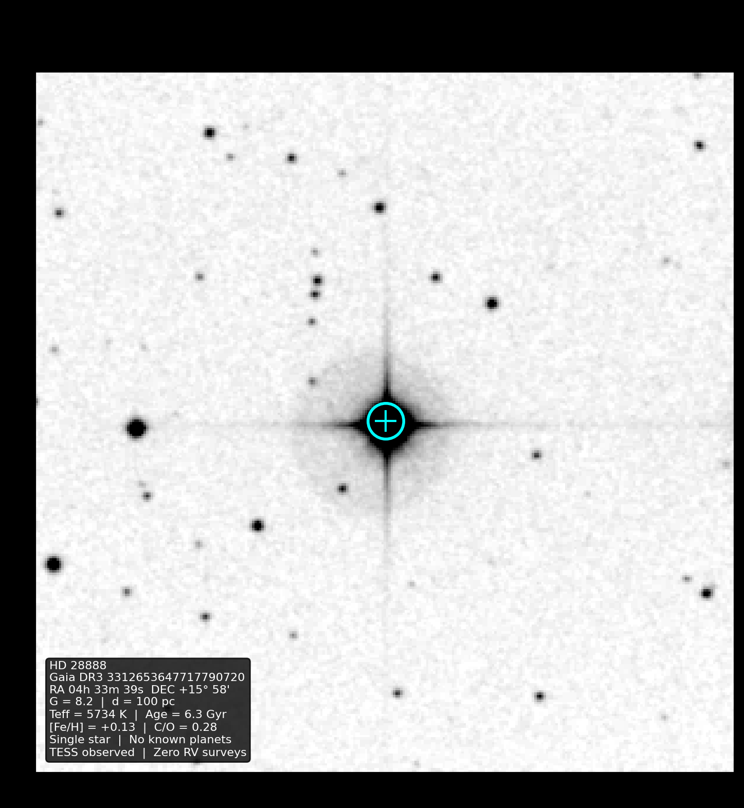
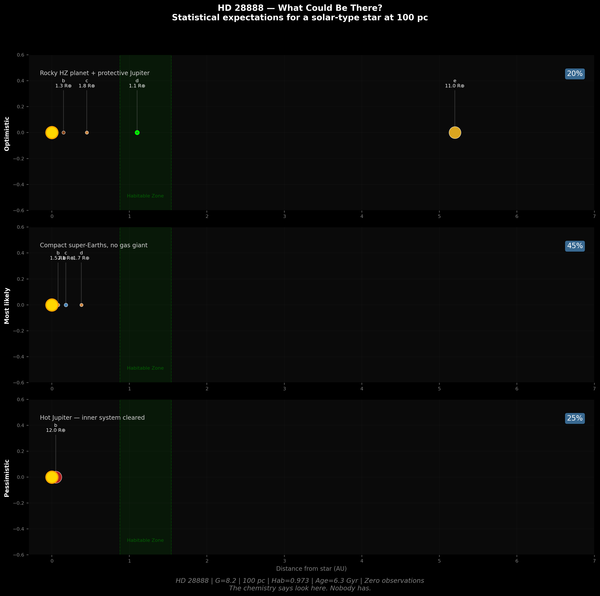

# Coherent Capture Theory — Empirical Test Series

*Stars carry a permanent chemical record of their birth. This repository contains the analysis that demonstrated it.*

**Certan (2026)**

Multi-instrument empirical analysis of chemical coherence in open clusters and the Milky Way field star population, using GALAH DR4 (917,588 stars) and APOGEE DR17 (OCCAM VAC, 2,515 stars in 85 clusters).

## Summary of Results

| Test | Finding | Significance |
|------|---------|--------------|
| **T9** | Open clusters carry distinct C/O fingerprints (GALAH, 655 clusters) | KW p < 10⁻¹⁰ |
| **T-APOGEE** | Confirmed independently in APOGEE (85 clusters) | KW p = 8.8×10⁻¹⁰⁴ |
| **T10** | Chemical coherence is spatially independent (after [Fe/H] control) | Partial Mantel r = 0.018, p = 0.46 |
| **T14** | Coherence degrades on τ = 1.29 Gyr (cluster dissolution timescale) | Spearman p = 4×10⁻³ |
| **T15** | Multi-element fingerprint: C/O predicts Mg/Fe (Fisher OR = 4.69) | p = 2.7×10⁻³ |
| **T17** | No decay in surviving clusters — survivorship bias | All ρ negative |
| **T18** | Alpha 2× tighter than s-process in 98% of clusters | Wilcoxon p = 10⁻⁹⁸ |
| **T19** | Outer disk weakly more coherent; persists after [Fe/H] control | Spearman ρ = −0.11, p = 0.008 (partial ρ = −0.18) |
| **T16b** | 2× enrichment of dissolved members in field (intra-GALAH) | 5 clusters sig |
| **T16c** | Enrichment flat 0–10 Gyr — fingerprint is permanent (τ > 10 Gyr) | AIC favors flat |
| **T16d** | Ba/Fe (5th dim, not used in matching) confirms 97.2% of clusters | Wilcoxon p = 10⁻⁴¹ |
| **T16e** | Kinematic residual: matched stars 5.2% closer in RV | Wilcoxon p = 10⁻³⁷ |

## Key Conclusions

1. **Chemical fingerprints are permanent** — no decay over 0–10 Gyr (τ > 5 Gyr at 2σ)
2. **Recoverable in dissolved field stars** — ~3× enrichment, confirmed by independent Ba/Fe and kinematic channels
3. **Multi-dimensional and nucleosynthetically structured** — alpha 2× tighter than s-process (first measurement of molecular cloud mixing hierarchy)
4. **Earth-like chemistry is common** — 41% of FGK dwarfs score excellent on 9D habitability
5. **Chemistry is not the habitability filter** — Jupiter analog architecture (3–6%) is the bottleneck, not formation chemistry
6. **Individual star recovery requires next-gen precision** — 0.02 dex surveys (4MOST) will enable routine co-natal tracing

## Precision Wall

This framework has reached the limit of current spectroscopic survey precision. At GALAH's 0.05 dex, 5D chemical matching at <0.10 dex RMS captures 5–25% of the field population — too broad to distinguish birth siblings from chemical neighbors. The co-natal tracing test (56 rocky exoplanet hosts) confirms this: background rate of 71,000 matches per star overwhelms any real signal.

**The framework is 4MOST-ready.** At 0.01 dex precision across 20+ elements for 5M+ stars, matching volume shrinks by ~10⁴. Background drops from 71,000 to ~7. Individual dissolved member recovery and co-natal planet host tracing become feasible. Expected data release: ~2028.

## Habitability Catalog (v2)

9-dimensional scorer applied to 12,234 GALAH DR4 FGK dwarfs:

| Dimension | Notes |
|-----------|-------|
| C/O ratio | Teff-corrected (ρ = -0.68 GALAH systematic) |
| Mg/Si | Silicate mineralogy / plate tectonics |
| [Fe/H] | Bulk metallicity |
| [Mg/Fe], [Si/Fe] | Alpha-element balance |
| [Ca/Fe], [Al/Fe] | Crustal/radiogenic heating |
| Volatile budget | Ba/Fe s-process enrichment proxy |
| Stellar age | Isochrone-derived |

**Validated:** OR = 0.78, p = 0.17 against confirmed FGK planet hosts (consistent with baseline after Teff correction). 4,970 stars score excellent (>0.9).

## Actionable Targets

917,588 → 4,970 → **18 stars** after sequential filtering:
- Excellent 9D habitability chemistry (>0.9)
- Single stars (Gaia RUWE < 1.4, no NSS flag)
- Within 200 pc
- Optimal age (2–8 Gyr)
- **Zero known planets. 13 never observed by any RV survey.**

### #1 Target: HD 28888

| Property | Value |
|----------|-------|
| Gaia DR3 | 3312653647717790720 |
| G mag | 8.2 |
| Distance | 100 pc |
| Teff | 5734 K |
| Age | 6.3 Gyr |
| [Fe/H] | +0.13 |
| C/O | 0.31 |
| Mg/Si | 1.03 |
| Hab Score | 0.973 |
| RUWE | 0.985 (single) |
| R_gal | 8.215 kpc (= Sun) |
| TESS | In TIC |
| RV surveys | **None** |
| Known planets | **None** |

25 elements measured, all unflagged. Sits at the same Galactocentric radius as the Sun. Nobody has ever looked for planets here.

**Est. rocky HZ planet probability: 23%** (Kepler occurrence rates for solar-type FGK dwarfs).

## Individual Star Recovery (T20)

Three clusters tested through 6D+age pipeline. Three honest eliminations:

| Target | Chemical Matches | Final | Outcome |
|--------|-----------------|-------|---------|
| Praesepe | 22,327 | 0 | PM insufficiently distinctive |
| NGC 6791 | 768 | 18 | Too distant for kinematics |
| NGC 6253 | 2,149 | 4 | Best candidate (HD 163560) eliminated by TESS asteroseismic age |

## Coherent Capture (Planetary)

44 exoplanet atmospheric compositions (LExACoM) classified by planet-star C/O mismatch. Wide-orbit planets match their host star's C/O (ρ = -0.37, p = 0.014) — opposite to disk chemistry predictions. Direct imaging planets 7× more likely to be CAPTURE class (Fisher p = 0.009). Metallicity confound partially present (partial ρ = -0.28, p = 0.075 after control).

## Retracted

**GENESIS catalog** — audit found 95% from single cluster (UBC_545), organic cloud filter anti-correlated with habitability (OR = 0.49). Removed from repo. The failure is documented in the git history.

## Data Requirements

Large catalog files (not included — obtain from source):
- `galah_dr4_allstar_240705.fits` — [GALAH DR4](https://www.galah-survey.org/dr4/) (~723 MB)
- `allStar-dr17-synspec_rev1.fits` — [APOGEE DR17](https://www.sdss.org/dr17/) (~2.5 GB)
- `occam_member-DR17.fits` — OCCAM membership (~4 MB)

## Scripts (32)

| Script | Function |
|--------|----------|
| `t5_coherence.py` – `t9_cluster_coherence.py` | Cluster coherence pipeline (GALAH) |
| `tapogee.py` | APOGEE independent replication |
| `t10_mantel.py` | Spatial independence test |
| `t14_decay_curve.py` | Coherence decay curve |
| `t15_multielement_coherence.py` | Multi-element simultaneous coherence |
| `t16b_dissolved_intra_galah.py` | Dissolved cluster recovery (Mahalanobis) |
| `t16c_permanence_test.py` | Fixed-threshold permanence test |
| `t16d_sproc_consistency.py` | Ba/Fe blind confirmation |
| `t16e_kinematic_traceback.py` | Kinematic RV residual test |
| `t17_coherence_ladder.py` | Multi-element coherence lifetime |
| `t18_nucleosynthetic_timestamp.py` | Alpha vs s-process hierarchy |
| `t19_galactic_radius.py` | Galactic radius coherence gradient |
| `t20_find_one_star.py` – `t20c_ngc6253.py` | Individual star recovery (3 targets) |
| `habitability_v2.py` | 9D habitability scorer (Teff-corrected) |
| `coherent_capture_analysis.py` | C/O mismatch formation pathway |
| `actionable_targets.py` | 18-star observable target list |

## Paper

MNRAS-format manuscript in [`paper/`](paper/):
- [`certan2026_cct.tex`](paper/certan2026_cct.tex) — LaTeX source (revised, 12 referee issues addressed)
- [`certan2026_cct.bib`](paper/certan2026_cct.bib) — bibliography

## License

MIT

## Author

David Certan (2026)
