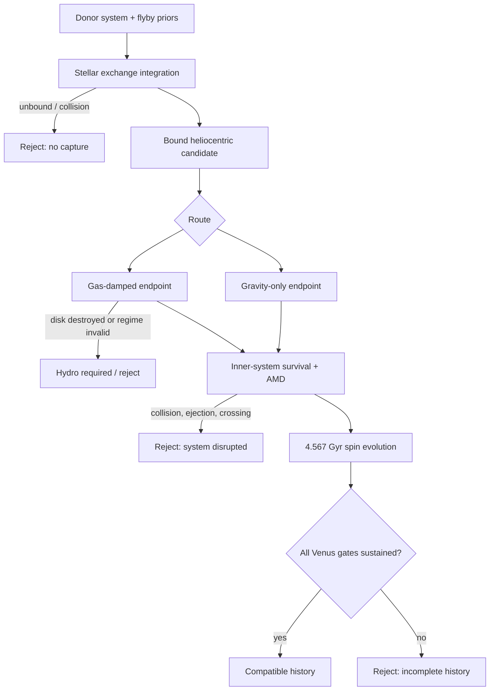

# Venus Capture Compatibility Test — Design and Preregistration Specification

**Date:** 2026-09-03  
**Repository:** `Raynergy-svg/ccr-coherent-capture-theory`  
**Status:** Design approved in chat; implementation is not yet authorized  
**Scope:** A Venus-specific test of stellar exchange capture under the current CCT v3 framework

## 1. Scientific question

This project tests the following conditional hypothesis:

> A Venus-mass planet formed around another star, entered the young Solar System through a stellar exchange encounter, retained or later acquired retrograde rotation, circularized into a Venus-like orbit, and remained dynamically compatible with the rest of the Solar System.

The calculation must separately measure:

1. exchange capture into a bound heliocentric orbit;
2. arrival in, or evolution into, Venus's orbital phase space;
3. survival of the other planets;
4. survival and effectiveness of a gas disk if gas damping is invoked;
5. evolution of the captured planet's spin;
6. the joint frequency of complete histories satisfying all gates.

The test is conditional on the stellar-exchange mechanism retained by CCT v3. It does not test or restore the refuted kappa/coherence scaling.

## 2. Interpretation boundary

A successful trajectory demonstrates dynamical compatibility, not historical proof. A failure may falsify a stated model only within the sampled priors and calibrated physical prescriptions.

Gravity-only integrations cannot produce Venus's present slow spin from an unspecified initial spin. In the point-mass limit the planet's intrinsic spin is passive and conserved. Therefore:

- a gravity-only success may preserve a preregistered inherited retrograde spin;
- it may not be described as generating the present spin;
- the post-capture tidal calculation must be used to claim spin evolution;
- if the atmospheric tide is calibrated directly to modern Venus, the endpoint is a compatibility check, not an independent prediction.

## 3. Visual model

The model is a funnel. No stage may silently condition away an upstream failure. Both conditional efficiencies and the end-to-end joint rate will be reported.

## 4. Locked present-day target

At the evaluation epoch a strict Venus analogue must satisfy all of the following:

| Quantity | Acceptance rule |
|---|---|
| Semimajor axis | within 1% of 0.723332 AU |
| Eccentricity | less than 0.020 |
| Inclination | 3.4 degrees ± 1.0 degree relative to the ecliptic |
| Orbital sense | prograde |
| Sidereal spin period | retrograde and within 10% of -243.025 days |
| Physical obliquity | within 5 degrees of 177.36 degrees |
| Endpoint persistence | all orbital and spin gates remain satisfied for the final 100 Myr |
| System survival | no planetary collision, ejection, or persistent orbit crossing; AMD gate satisfied |

A secondary "exact-current-orbit" diagnostic will use eccentricity no greater than 0.010. It cannot replace the strict preregistered endpoint above.

## 5. Architecture

### 5.1 Audit module

Before generating Venus outcomes, reproduce and audit the existing Phase C engine. The audit will test, rather than presume, four suspected issues:

- whether the fixed 12,000-year duration ends before periapsis for any 0.5 km/s starts at 5,000 AU;
- whether the implemented energy threshold differs from the preregistered threshold;
- whether the random seed rule differs from the preregistered rule;
- whether double-bound cases and the reported obliquity proxy match the preregistered definitions.

The audit produces a machine-readable discrepancy report. Existing Phase C files remain unchanged. Any corrected Venus engine receives its own version and preregistration.

### 5.2 Encounter module

Use REBOUND IAS15 for star-star-planet integrations. Each run begins with a Venus-mass planet bound to a donor star. The incoming Solar analogue follows a hyperbolic orbit defined by donor mass, donor orbit, stellar periapsis, velocity at infinity, and isotropic encounter orientation.

The start radius is

`R₀ = max(100 AU, 100 a_D, 20 q)`.

The integration stops only after the stellar perturber has passed periapsis and is outbound beyond $R_0$. Candidate classifications are verified by extending to $2R_0$. A bound classification must remain stable for 100 new heliocentric orbital periods.

Numerical requirements:

- IAS15 tolerance: $10^{-12}$;
- scaled energy and angular-momentum error: at most $10^{-10}$;
- linear-momentum error: at most $10^{-12}$;
- failed cases are rerun at tighter tolerance;
- accepted rare candidates receive a forward-reverse replay.

### 5.3 Forward survey

The locked grid is:

| Parameter | Values |
|---|---|
| Donor-star mass / solar mass | 0.50, 0.75, 1.00, 1.25 |
| Reference donor semimajor axis / AU | 0.60, 0.723332, 0.90 |
| Actual donor semimajor axis | donor mass × reference semimajor axis |
| Donor eccentricity | 0.00, 0.05 |
| Stellar periapsis / donor semimajor axis | 0.05, 0.10, 0.20, 0.35, 0.50, 0.75, 1.00, 1.25, 1.50, 2.00, 3.00, 4.00 |
| Velocity at infinity / km s⁻¹ | 0.10, 0.30, 0.50, 1.00, 2.00, 3.00, 5.00, 10.00 |

Each cell receives four independently scrambled Sobol batches of 1,024 orientations/phases, for 2,359,296 runs. The first 128 members of each batch form a declared screening tranche. Screening results may control scheduling but may not alter the grid, priors, endpoint, or final denominator.

The primary forward result is an encounter-conditional efficiency. An astrophysical occurrence rate requires an explicit cluster prior and gravitationally focused cross-section weighting and will be reported separately.

### 5.4 Reverse importance survey

Because the Venus endpoint occupies a very small phase-space volume, a reverse survey will integrate present-Venus-like states backward through the encounter. It will target the strict endpoint region and estimate the donor-state measure using stored proposal probabilities.

The reverse survey is an importance sampler, not a replacement denominator. Every reported estimate must include its likelihood ratio, effective sample size, and a comparison against forward-sampled overlap. A reverse-only pathway with no forward overlap is labeled unresolved.

### 5.5 Solar-System survival module

Every strict or near-strict candidate is replayed with Mercury, Earth-Moon barycenter, Mars, Jupiter, Saturn, Uranus, and Neptune. Sixteen clones vary the planets' mean longitudes.

Immediate gates:

- no collision or ejection;
- no persistent orbit crossing;
- bounded total energy and angular-momentum errors;
- post-encounter angular-momentum deficit no larger than the locked threshold derived from the present terrestrial system.

Candidates are propagated for $10^5$ years. Survivors continue for 10 Myr. The final production plan will specify the integrator handoff and timestep before execution; no outcome may be inspected to choose them.

### 5.6 Gas-damping module

This route asks whether a residual young solar nebula can circularize and align a captured orbit. The disk model is

`Σ(r,t) = f_Σ × 1700 × (r/AU)^(-p) × exp(-t/τ_d) g cm⁻²`.

Locked sensitivity grid:

- $f_\Sigma = 0.01, 0.03, 0.10, 0.30, 1.00$;
- $p = 0.5, 1.0, 1.5$;
- aspect ratio at 1 AU $h_0 = 0.025, 0.035, 0.050$;
- flaring index = 0 or 0.25;
- remaining disk lifetime = 0.1, 0.3, 1.0, or 3.0 Myr;
- flyby truncation factor (r_{
m out}/q = 0.2, 0.3, 0.5);
- disk tilt = 0, 5, 15, or 30 degrees.

Cresswell-Nelson and Ida-style eccentricity/inclination damping are independent model families. Relevant high-eccentricity, high-inclination, or retrograde states outside their calibration domain are labeled `OUTSIDE_CALIBRATED_REGIME`, not extrapolated as ordinary successes. A high-inclination prescription may be used only as a bracket.

The module tracks orbital energy removed from the planet. It reports the circularization energy alongside Venus's gravitational binding energy and plausible disk dissipation capacity. The planet's spin is not allowed to absorb a meaningful fraction of orbital circularization energy.

Disk truncation is a hard coupled constraint: a flyby that removes the disk needed for damping invalidates that continuous history. Cases whose outcome depends on disk hydrodynamics, gas transfer, shocks, warps, or stripping receive `HYDRO_REQUIRED`.

### 5.7 Spin-evolution module

Spin evolution begins from both inherited-retrograde cases and prograde controls.

Initial sidereal periods:

- retrograde: -5, -10, -24, -72, and -240 hours;
- prograde controls: +5, +10, +24, +72, and +240 hours.

The model combines:

- Darwin-Kaula solid-body tides with Andrade-Maxwell rheology;
- atmospheric thermal tides;
- core-mantle coupling;
- obliquity evolution.

Locked sensitivity ranges:

| Parameter | Values/range |
|---|---|
| Moment coefficient `C/(MR²)` | 0.31–0.35 |
| Love number `k₂` | 0.20–0.40 |
| Andrade exponent | 0.15–0.35 |
| Maxwell time | $10^2$–$10^4$ yr |
| Triaxiality | $10^{-6}$–$10^{-4}$ |
| Core-mantle coupling | two-decade bracket |
| Atmosphere pressure | 0, 1, 10, 92 bar |
| Thermal-tide amplitude | 0.5, 1.0, 2.0 × Venus calibration |
| Atmosphere onset | 10, 100, 500, 1,000 Myr |

The integration runs to 4.567 Gyr and evaluates both endpoint agreement and the final 100 Myr persistence rule.

## 6. Additional discriminating tests

Three tests sit beside the main funnel because they may be more decisive than the spin endpoint:

1. **Disk-age contradiction:** quantify whether encounters close enough for exchange leave enough disk, for long enough, to circularize Venus while allowing the terrestrial system to exist.
2. **Thermal budget:** calculate `ΔE = G M☉ M_V e_i² / (2 a_V)` as a first-order circularization scale and compare it with planetary binding energy, disk capacity, and permitted thermal histories.
3. **Compositional birth certificate:** define future sample-return observables in oxygen, titanium, chromium, calcium, molybdenum/ruthenium, and tungsten isotope space. This is a prediction framework, not a current simulation gate.

Moonlessness and present atmospheric isotopes are reported only as weak contextual evidence, not standalone confirmation.

## 7. Data products and reproducibility

Every run records:

- immutable configuration hash and software versions;
- seed or Sobol index;
- complete initial state;
- encounter diagnostics and closest approach;
- numerical conservation diagnostics;
- classification at $R_0$, $2R_0$, and after the stability window;
- orbital elements and physical spin vector;
- every gate result and failure reason;
- proposal weight for reverse samples;
- disk-model calibration-domain flags;
- provenance linking derived runs to the parent encounter.

Outputs use append-only Parquet tables plus compact JSON summaries. Checkpoints are restartable. Plots and notebooks read only finalized tables and never overwrite raw results.

## 8. Statistical reporting

Report the complete funnel:

`f_joint = f_capture × f_orbit|capture × f_survival|orbit × f_disk|survival × f_spin|orbit,disk`.

The factors will also be reported separately to expose bottlenecks. Binomial intervals use a declared 95% method. Weighted estimates include effective sample size. Zero-event cells report upper bounds rather than zero probability. Fixed grid cells are not averaged as though equally common in nature; astrophysical weighting is a separate sensitivity calculation.

A simple isotropic benchmark will accompany the simulations. For example, a thermal eccentricity distribution gives approximately `P(e < 0.00677) = e² ≈ 4.6 × 10⁻⁵`, illustrating why endpoint-targeted importance sampling is needed.

## 9. Verdict rules

| Verdict | Rule |
|---|---|
| `ROBUST_COMPATIBLE` | Lower 95% bound on the joint conditional fraction exceeds 1%, successes occur under both gas-damping families and adjacent disk-density/lifetime cells, and no required step is outside calibration. |
| `FINE_TUNED_ONLY` | At least one complete history succeeds, but only in isolated parameter cells, under calibrated modern-Venus forcing, or with a joint fraction whose lower 95% bound is at most 1%. |
| `NOT_COMPATIBLE` | No complete history succeeds and the upper 95% bound is below 1% for the preregistered model class. |
| `HYDRO_REQUIRED` | The result changes by more than a factor of three between damping prescriptions or depends on trajectories outside calibrated regimes / unresolved disk hydrodynamics. |

A `ROBUST_COMPATIBLE` verdict supports possibility within this model; it does not establish that capture occurred.

## 10. Tests before production

Implementation must pass:

- analytic two-body hyperbola and bound-orbit fixtures;
- known exchange/non-exchange fixtures;
- rotation-invariance and unit-invariance tests;
- deterministic Sobol/seed replay;
- start-radius convergence;
- tolerance convergence;
- forward-reverse trajectory replay;
- capture classification persistence;
- disk-damping limiting cases;
- solid-tide and atmospheric-tide limiting cases;
- conservation and schema validation;
- a dry run that proves plots cannot read incomplete production tables.

No Venus outcome plot is generated until these tests pass and the production configuration hash is sealed.

## 11. Deliverables

The implementation phase will produce:

1. an audit report for the existing Phase C code and results;
2. a sealed Venus preregistration/configuration;
3. encounter, survival, gas, and spin modules with tests;
4. restartable batch runners;
5. finalized raw and summary tables;
6. a reproducible notebook;
7. a visual funnel dashboard showing yield and failure modes;
8. a written conclusion using only the four locked verdict labels.

## 12. Explicit exclusions

The first implementation does not include full radiation hydrodynamics, atmospheric escape/climate evolution, giant impacts, or a claimed absolute occurrence rate without an external cluster prior. These are follow-up projects if the `HYDRO_REQUIRED` or fine-tuning boundaries make them necessary.
